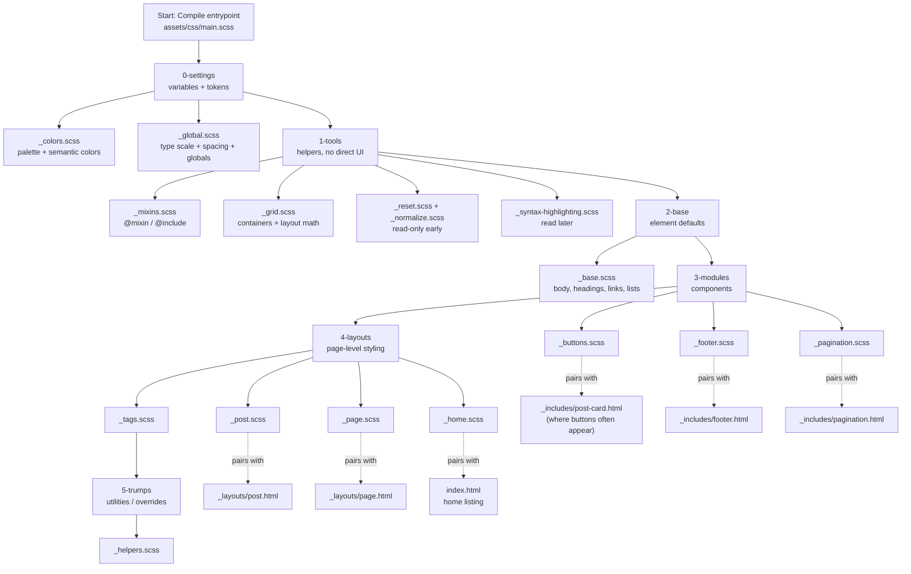

# Sass Learning Map + Template Design & Review Plan (iwanjekyll)

This doc is based on your repo tree (folders: `_sass/`, `_includes/`, `_layouts/`, `assets/`, `_posts/`, etc.).

---

## Sass Learning Map (Diagram)



---

## Readable checklist (same map, no Mermaid)

### Phase 1 — Tokens (fast wins)
1. `_sass/0-settings/_colors.scss`
2. `_sass/0-settings/_global.scss`

### Phase 2 — Tools (read to recognize patterns)
3. `_sass/1-tools/_mixins.scss`
4. `_sass/1-tools/_grid.scss`

(Keep these for later deep-dives: `_reset.scss`, `_normalize.scss`, `_syntax-highlighting.scss`)

### Phase 3 — Foundation CSS
5. `_sass/2-base/_base.scss`

### Phase 4 — Components (pair modules with HTML)
6. `_sass/3-modules/_buttons.scss`  ↔ `_includes/post-card.html`
7. `_sass/3-modules/_footer.scss`   ↔ `_includes/footer.html`
8. `_sass/3-modules/_pagination.scss` ↔ `_includes/pagination.html`

### Phase 5 — Page layouts (pair with layouts)
9. `_sass/4-layouts/_post.scss`  ↔ `_layouts/post.html`
10. `_sass/4-layouts/_page.scss` ↔ `_layouts/page.html`
11. `_sass/4-layouts/_home.scss` ↔ `index.html`
12. `_sass/4-layouts/_tags.scss` ↔ `tags.html`

### Phase 6 — Utilities / overrides
13. `_sass/5-trumps/_helpers.scss`

---

## Template Design & Review Plan (based on your tree)

### Goals
- Keep changes **maintainable** (theme-like structure stays intact)
- Make UX improvements without breaking Jekyll/Liquid conventions
- Fix Sass warnings while learning (one file at a time)

---

## 0) Baseline: snapshot + guardrails (once)

**Do this first**
- Create a branch: `design-refresh`
- Add a quick “before” screenshot set (home, post, tags, 404)

**Guardrails**
- Do **not** hand-edit `_site/` (generated output)
- Treat `assets/css/main.scss` as the *import hub*, not a styling dump
- Prefer edits in `_sass/` over inline styles or scattered CSS

---

## 1) Design tokens review (settings)

### Files
- `_sass/0-settings/_colors.scss`
- `_sass/0-settings/_global.scss`

### Checklist
- [ ] Define “semantic” colors: primary / accent / text / muted / border / background
- [ ] Confirm link colors and hover states meet contrast
- [ ] Set a consistent type scale (body, small, h1–h4)
- [ ] Confirm base line-height and max-width for readability

### Output
- A small palette section in your README (optional)
- A “tokens” comment block at top of `_colors.scss`

---

## 2) Typography & base styling review

### Files
- `_sass/2-base/_base.scss`
- (reference) `_includes/head.html` for font loading + meta

### Checklist
- [ ] Body font size readable (16–18px equivalent)
- [ ] Line-height comfortable (1.5–1.7)
- [ ] Headings have consistent spacing
- [ ] Links are recognizable (underline or strong contrast)
- [ ] Code blocks readable (monospace size/contrast)

### Output
- “Before/After” notes: body size, line-height, headings, links

---

## 3) Layout structure review (HTML first, then CSS)

### Files
- `_layouts/default.html`
- `_includes/header.html`
- `_includes/footer.html`
- `_sass/1-tools/_grid.scss`
- `_sass/4-layouts/_home.scss`, `_page.scss`, `_post.scss`

### Checklist
- [ ] Single, clear container width (avoid too wide text)
- [ ] Header nav is predictable and not overcrowded
- [ ] Footer contains: copyright, social, optional email
- [ ] Mobile spacing: no cramped sections, no overflow

### Output
- A short “layout rules” note: container width, breakpoints, spacing rhythm

---

## 4) Component review (pair modules with includes)

### Buttons
- Sass: `_sass/3-modules/_buttons.scss`
- HTML: `_includes/post-card.html` (and any CTA)

Checklist:
- [ ] One primary button style, one secondary
- [ ] Hover/focus visible
- [ ] Padding consistent
- [ ] Border radius consistent

### Pagination
- Sass: `_sass/3-modules/_pagination.scss`
- HTML: `_includes/pagination.html`

Checklist:
- [ ] Current page state clear
- [ ] Tap targets large enough on mobile

### Post cards
- Sass likely in: `_sass/4-layouts/_home.scss` and/or modules
- HTML: `_includes/post-card.html`

Checklist:
- [ ] Title prominent
- [ ] Excerpt readable
- [ ] Metadata (date/read time) visually secondary

---

## 5) Content templates review (posts + pages)

### Files
- `_layouts/post.html`
- `_layouts/page.html`
- `_includes/read-time.html`
- `_includes/social-share.html`
- `_posts/*.md`

Checklist:
- [ ] Post header: title, date, tags, read time
- [ ] Images scale well and don’t break layout
- [ ] Lists and blockquotes have good spacing
- [ ] Code blocks wrap/scroll properly

---

## 6) “Trumps” & utilities review (last)

### File
- `_sass/5-trumps/_helpers.scss`

Checklist
- [ ] Utilities are named clearly (`.u-` prefix if you want)
- [ ] Avoid adding many one-off helper classes
- [ ] Use only for rare overrides, not normal styling

---

## 7) QA pass (each change set)

### Pages to check every time
- Home: `index.html`
- A post page: any `_posts/…`
- Tags: `tags.html`
- 404: `404.html`

### QA checklist
- [ ] No horizontal scroll on mobile
- [ ] Link styles consistent
- [ ] Heading spacing consistent
- [ ] Images responsive
- [ ] Focus states visible (keyboard navigation)

---

## Practical workflow for “one Sass file at a time” (no Jekyll serve loop)

You can compile Sass directly (fast) from the repo root:

```bash
# 1) Compile once (no watch)
sass assets/css/main.scss _site/assets/css/main.css

# 2) Watch (auto recompile on changes)
sass --watch assets/css/main.scss:_site/assets/css/main.css

# 3) Add source maps (helpful for debugging)
sass --watch --source-map assets/css/main.scss:_site/assets/css/main.css
```

Notes:
- Jekyll normally writes `_site/assets/css/main.css` for you.
- This direct Sass compile is great for rapid iteration on styles **without** rebuilding pages.

---

## Notes section (fill as you go)

### Decisions
- Primary color:
- Accent color:
- Body font:
- Heading font:
- Base font size:
- Line-height:
- Max content width:

### Issues to revisit
- [ ] 
- [ ] 
- [ ] 

---
